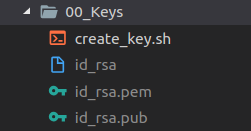
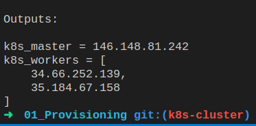

# mSTakx Challenge v.3 - DevOps Enginner 

Draw.io here

## Welcome ##

Here install the K8s cluster with scripts Terraform, Ansible and Shell
but first, Create service account credentials in the Google Cloud Platform:

1. In the [Cloud Platform Console](https://console.cloud.google.com), click Credentials in the left navigation. The Credential page appears.
2. From the Create credentials drop-down list, select Service account key. The Create service account key page appears.
3. From the Service account drop-down list, select New service account .
4. Enter a name in the Service account name field.
(optional) Edit the service account ID.
5. Click JSON.
6. Click Create. A Service account has no role dialog appears.
7. Click Create Without Role. A Private key saved to your computer dialog appears and a copy of the private key downloads to your computer.
8. Click Close.

>For further information on service accounts, refer to Service accounts, web applications, and installed applications

### View credentials ###
1. From the [Cloud Platform Console](https://console.cloud.google.com), select the project you created at the top of the page.
2. Click the Navigation menu to the left of the Google Cloud Console banner.
3. Click IAM and Admin > Service accounts.
4. In the list, under Service account ID, make note of the generated email address that identifies the service account you configured.  This email address is used when adding a data source to Cloud Search.

### Great now let's go to deploy!!!
>ps:Do you already installed this [prerequisitos](https://github.com/diogoab/mstakx/tree/master), if yes, let's go!!!

### 1. Create keys RSA:
>used shell script for this
```
$ cd 00_Keys

$ ./create_key.sh

$ cd ..
```

After Look like this:



### 2. Provision of machines:
>used Terraform for provision

2.1 Edit file main.tf, insert your Gcloud_key.json location in
```
 credentials = "${file("key_is_here.json")}"
```
2.2 Change file variables.tf, the name of your informations, Project_ID, Region and Zone:
```
variable "project_id" {
  type    = "string"
  default = "your_project_is_here"
}

variable "region" {
  type  = "string"
  default = "your_region_is_here"
}

variable "zone" {
  type = "string"
  default = "your_zone_is_here"
}

```
and now...
```
$ cd 01_Provisioning

$ ./provisioning_now.sh

$ cd ..
```
After Look like this:



very good! get master and worker IPs and insert into Anbisle inventory in k8s-master,k8s-worker-1 and k8s-worker-2:
```
02_K8s_cluster/hosts

[masters]
master ansible_host=k8s-master ansible_user=ubuntu ansible_ssh_private_key_file=../00_Keys/id_rsa.pem

[workers]
worker1 ansible_host=k8s-worker-1 ansible_user=ubuntu ansible_ssh_private_key_file=../00_Keys/id_rsa.pem
worker2 ansible_host=k8s-worker-2 ansible_user=ubuntu ansible_ssh_private_key_file=../00_Keys/id_rsa.pem


```
### 3. Install de Cluster
>used Ansible for installation
```
$ cd 02_K8s_cluster

$ ./install_cluster.sh

```
